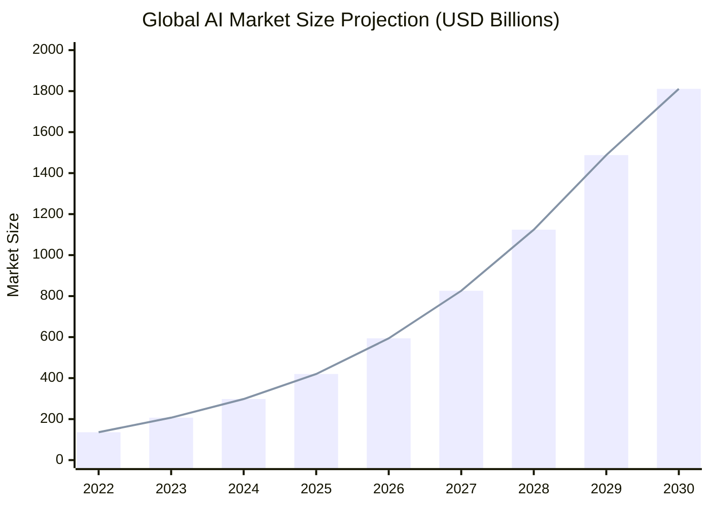
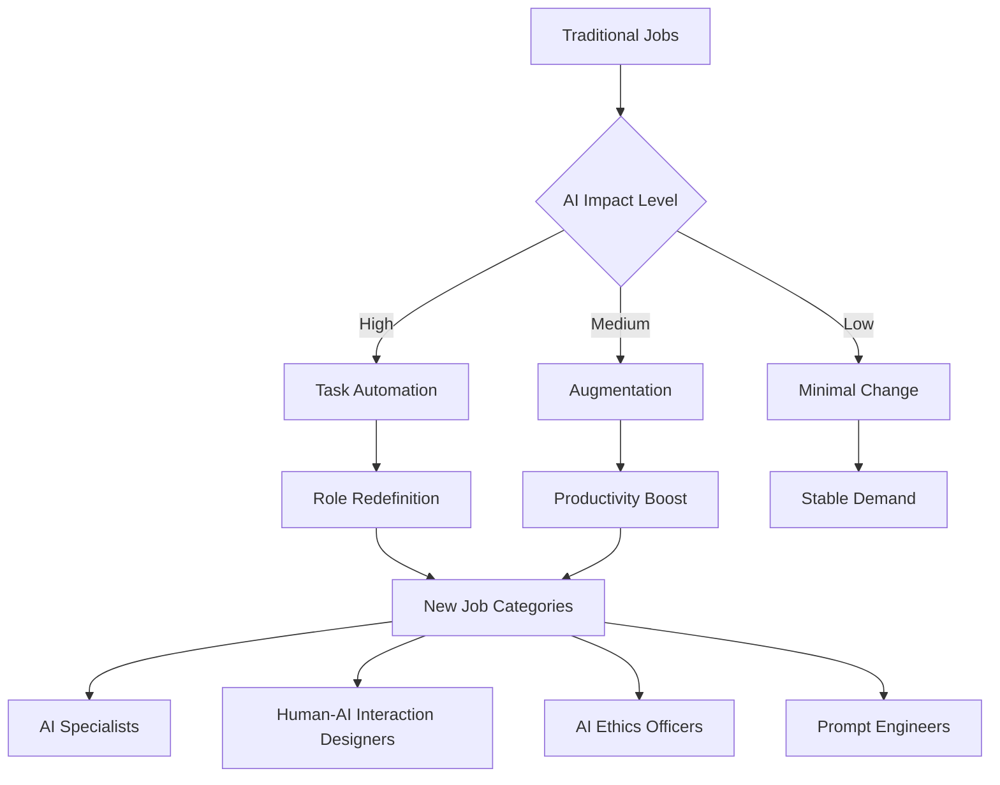
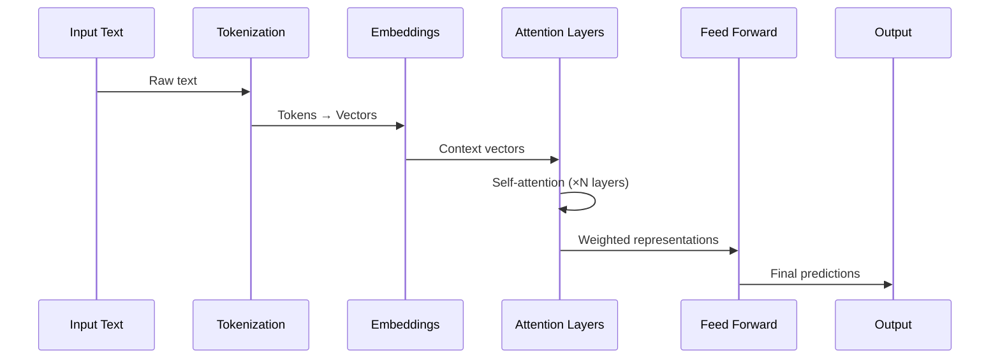
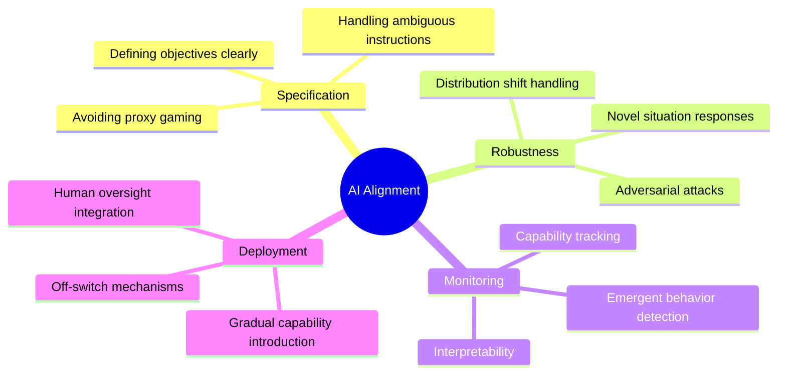

# The AI Revolution: Transforming Our World in 2024 and Beyond

The artificial intelligence revolution is no longer a distant future—it's happening right now, reshaping industries, redefining work, and challenging our understanding of what it means to be human[^1]. From the sudden emergence of large language models to the rapid adoption of AI-powered tools across every sector, we are witnessing one of the most significant technological shifts in human history[^mckinsey-2024].

This comprehensive analysis explores the current state of AI, its transformative impact across industries, the challenges we face, and what the future holds for humanity in an AI-augmented world.

---

## The Dawn of Generative AI

### From GPT-3 to GPT-4: A Quantum Leap

The release of ChatGPT in November 2022 marked a watershed moment in AI accessibility[^2]. What started as a research preview quickly became the fastest-growing consumer application in history, reaching 100 million users in just two months[^3]. But the real transformation came with the subsequent release of GPT-4, which demonstrated remarkable improvements in reasoning, creativity, and reliability.

**Key Milestones in Generative AI:**

| Model | Release Date | Parameters | Notable Capabilities |
|-------|-------------|------------|---------------------|
| GPT-3 | June 2020 | 175B | Text generation, basic reasoning |
| GPT-3.5 | March 2022 | ~175B | Improved instruction following |
| GPT-4 | March 2023 | Undisclosed | Multimodal, complex reasoning, coding |
| GPT-4 Turbo | November 2023 | Undisclosed | Larger context, knowledge cutoff 2023 |
| Claude 3 | March 2024 | Undisclosed | Superior reasoning, longer context |
| Gemini Pro | December 2023 | Multimodal | Native multimodal capabilities |

The progression has been staggering. While GPT-3 was impressive, GPT-4 demonstrated near-human performance on professional benchmarks including the bar exam, SAT, and various professional certifications[^openai-gpt4]. This leap wasn't just incremental—it represented a fundamental shift in AI capabilities.

### The Multimodal Revolution

AI systems are no longer limited to text. Modern models can process and generate images, audio, video, and code simultaneously[^4]. This multimodal capability opens entirely new possibilities:

- **Visual Understanding**: Analyzing medical images, interpreting charts, understanding design mockups
- **Code Generation**: Converting natural language to functional code across dozens of programming languages
- **Creative Production**: Generating artwork, music, and video content from text descriptions
- **Real-time Interaction**: Voice conversations with AI that feel natural and contextual

> 💡 **Key Insight**: The shift to multimodal AI represents a move toward more human-like cognition. Just as humans process multiple sensory inputs simultaneously, AI systems are beginning to integrate diverse data types into coherent understanding.

---

## Industry Transformation: AI Across Sectors

### Healthcare: From Diagnosis to Drug Discovery

The healthcare industry is experiencing one of the most profound AI transformations[^5]. The applications extend far beyond simple automation:

**Diagnostic Accuracy Improvements:**

```
┌─────────────────────────────────────────────────────────┐
│  AI Diagnostic Performance vs. Human Specialists          │
├─────────────────────────────────────────────────────────┤
│  Skin Cancer Detection                                    │
│  Human Dermatologists: 86.6% accuracy                   │
│  AI System (Stanford): 91.2% accuracy                     │
│  AI + Human: 95.1% accuracy                               │
├─────────────────────────────────────────────────────────┤
│  Diabetic Retinopathy                                     │
│  AI System (Google): 90.3% sensitivity                   │
│  FDA Approved for Clinical Use: 2018                      │
├─────────────────────────────────────────────────────────┤
│  Breast Cancer Screening                                  │
│  AI Reduction in False Positives: 5.7%                   │
│  AI Reduction in False Negatives: 9.4%                   │
└─────────────────────────────────────────────────────────┘
```

**Revolutionary Applications:**

1. **Drug Discovery**: AI has reduced the time to identify drug candidates from years to months[^6]. Companies like DeepMind's AlphaFold have solved the protein folding problem, accelerating pharmaceutical research exponentially.

2. **Personalized Medicine**: AI analyzes genetic profiles, lifestyle data, and medical history to create tailored treatment plans with unprecedented precision.

3. **Predictive Healthcare**: Machine learning models predict disease outbreaks, patient deterioration, and hospital readmissions with remarkable accuracy.

### Software Development: The Copilot Era

Software engineering has been fundamentally altered by AI-powered development tools[^7]. GitHub Copilot, launched in 2021, has evolved from a novel experiment to an essential tool for millions of developers.

**Developer Productivity Metrics:**

```chart
{
  "title": "AI Impact on Developer Productivity",
  "type": "bar",
  "data": {
    "labels": ["Code Completion", "Documentation", "Bug Detection", "Code Review", "Testing"],
    "datasets": [{
      "label": "Time Saved (%)",
      "data": [55, 45, 40, 35, 30],
      "backgroundColor": ["#667eea", "#764ba2", "#f093fb", "#f5576c", "#4facfe"]
    }]
  },
  "options": {
    "legend": false
  }
}
```

The impact extends beyond simple code completion:

- **Architectural Decisions**: AI suggests optimal system architectures based on requirements
- **Security Analysis**: Real-time vulnerability detection and suggested fixes
- **Legacy Modernization**: Automatically translating outdated code to modern frameworks
- **Natural Language Programming**: Describing desired functionality in plain English and receiving working code

### Creative Industries: Augmentation, Not Replacement

Contrary to fears of AI replacing human creativity, we're seeing a pattern of augmentation[^8]. Creative professionals are using AI as a powerful tool to enhance their work:

**Creative AI Adoption Rates by Discipline:**

| Discipline | Adoption Rate | Primary Use Cases |
|------------|--------------|-------------------|
| Graphic Design | 68% | Concept generation, asset creation, variations |
| Video Production | 52% | Editing assistance, effects, voiceover |
| Music Production | 45% | Composition assistance, mixing, mastering |
| Writing/Content | 73% | Research, outlining, editing, SEO optimization |
| Photography | 41% | Editing, retouching, organization |

> "AI doesn't replace creativity—it removes the technical barriers that once separated ideas from execution."
> — Refik Anadol, Media Artist and Director

---

## The Economic Impact: Numbers and Trends

### Global AI Market Growth

The economic implications of AI adoption are staggering[^mckinsey-2024]. According to recent research, AI could contribute between $2.6 trillion to $4.4 trillion annually to the global economy across 63 analyzed use cases.



**Key Economic Drivers:**

1. **Labor Productivity**: Automation of routine tasks allows human workers to focus on higher-value activities
2. **Innovation Acceleration**: Reduced time-to-market for new products and services
3. **Cost Reduction**: Operational efficiencies across manufacturing, logistics, and service industries
4. **New Market Creation**: Entirely new categories of products and services enabled by AI capabilities

### Job Market Evolution

The relationship between AI and employment is complex and often misunderstood[^9]. While certain roles face displacement, new categories of jobs are emerging:

**Job Transformation Patterns:**



**Emerging Roles in the AI Era:**

| New Role | Description | Average Salary (USD) |
|----------|-------------|-------------------|
| Prompt Engineer | Designs effective inputs for AI systems | $175,000 - $300,000 |
| AI Ethics Officer | Ensures responsible AI development | $150,000 - $250,000 |
| Human-AI Interaction Designer | Optimizes collaboration between humans and AI | $120,000 - $200,000 |
| AI Infrastructure Architect | Designs scalable AI systems | $180,000 - $350,000 |
| Model Curator | Selects and fine-tunes AI models for specific use cases | $100,000 - $180,000 |

---

## Technical Architecture: How Modern AI Works

### Transformer Architecture: The Foundation

At the heart of modern AI lies the transformer architecture, introduced in the seminal paper "Attention Is All You Need" (2017)[^10]. This architecture enables models to process vast amounts of data and capture complex patterns.

**Transformer Process Flow:**



**Key Technical Components:**

1. **Self-Attention Mechanism**: Allows the model to weigh the importance of different words in context
2. **Multi-Head Attention**: Processes multiple representation subspaces simultaneously
3. **Positional Encoding**: Injects sequence order information
4. **Feed-Forward Networks**: Transform representations between attention layers

### Scaling Laws: Why Bigger Often Means Better

AI capabilities follow predictable scaling laws[^11]. As models increase in size (parameters), training data, and compute, their performance improves in ways we can forecast:

**Scaling Relationships:**

$$Loss \propto \frac{1}{N^{0.5}}$$

Where $N$ represents model parameters, data size, or compute. This relationship held remarkably consistent from models with millions to hundreds of billions of parameters.

> 💡 **Technical Insight**: The consistency of scaling laws has been crucial for AI development. It allows researchers to predict the capabilities of larger models before investing the enormous resources required to train them.

### Training Infrastructure: The Compute Behind AI

Modern AI requires massive computational resources[^12]:

**GPT-4 Training Estimates:**

| Resource | Estimate | Context |
|----------|----------|---------|
| Compute | ~$100M | Equivalent to thousands of high-end GPUs |
| Energy | ~1,287 MWh | Comparable to 120 US homes annually |
| Training Time | ~3-6 months | Continuous training on specialized clusters |
| Data Tokens | ~13 trillion | Equivalent to millions of books |

```chart
{
  "title": "AI Training Compute Growth (FLOPs)",
  "type": "line",
  "data": {
    "labels": ["2012", "2014", "2016", "2018", "2020", "2022", "2024"],
    "datasets": [{
      "label": "Training FLOPs (×10²¹)",
      "data": [0.001, 0.01, 0.1, 1, 10, 100, 1000],
      "borderColor": "#667eea",
      "backgroundColor": "rgba(102, 126, 234, 0.1)",
      "fill": true
    }]
  },
  "options": {
    "legend": false,
    "scales": {
      "y": {
        "type": "logarithmic"
      }
    }
  }
}
```

---

## Challenges and Ethical Considerations

### The Alignment Problem

Perhaps the most critical challenge in AI development is ensuring that increasingly powerful systems remain aligned with human values and intentions[^13]. This encompasses several sub-problems:

**Alignment Challenge Areas:**



### Bias and Fairness

AI systems trained on human-generated data inevitably reflect human biases[^14]. Addressing this requires:

1. **Diverse Training Data**: Ensuring representation across demographics
2. **Bias Detection Tools**: Automated systems for identifying unfair outcomes
3. **Human-in-the-Loop**: Keeping humans involved in consequential decisions
4. **Continuous Monitoring**: Tracking model behavior post-deployment

**Bias Mitigation Strategies:**

| Strategy | Implementation | Effectiveness |
|----------|---------------|-------------|
| Data Augmentation | Balancing underrepresented groups | 70-85% |
| Adversarial Debiasing | Training against bias predictors | 60-75% |
| Post-processing | Adjusting outputs for fairness | 50-65% |
| Multi-task Learning | Fairness as explicit objective | 75-90% |

### Privacy and Security

As AI systems process increasingly sensitive data, privacy protection becomes paramount[^15]. Key techniques include:

- **Federated Learning**: Training models without centralizing data
- **Differential Privacy**: Mathematical guarantees on privacy leakage
- **Homomorphic Encryption**: Computing on encrypted data
- **Secure Multi-Party Computation**: Collaborative training without exposing individual data

---

## The Future: What's Coming Next

### Artificial General Intelligence (AGI)

The ultimate goal for many AI researchers is AGI—systems that can match or exceed human cognitive abilities across all domains[^16]. Current estimates for AGI arrival vary widely:

**Expert Predictions for Transformative AI:**

```chart
{
  "title": "Expert Predictions: When Will Human-Level AI Arrive?",
  "type": "pie",
  "data": {
    "labels": ["Before 2030", "2030-2040", "2040-2050", "After 2050", "Never"],
    "datasets": [{
      "data": [15, 45, 30, 8, 2],
      "backgroundColor": ["#ff6b6b", "#4ecdc4", "#45b7d1", "#96ceb4", "#dfe6e9"]
    }]
  },
  "options": {
    "legend": true
  }
}
```

### Key Near-Term Developments (2024-2027)

Based on current research trajectories and industry roadmaps:

1. **Multimodal Agents**: AI systems that can seamlessly work across text, images, audio, video, and physical environments
2. **Reasoning Enhancement**: Models with significantly improved logical reasoning and planning capabilities
3. **Efficient Architectures**: AI systems requiring less compute while maintaining or improving capabilities
4. **Personalized Models**: AI fine-tuned to individual users while preserving privacy
5. **Scientific Discovery**: AI making novel scientific discoveries with minimal human guidance

### Societal Implications

The widespread adoption of AI will fundamentally reshape society[^17]:

**Potential Positive Outcomes:**
- Solving previously intractable scientific problems
- Democratizing access to expertise (medical, legal, educational)
- Accelerating economic growth and poverty reduction
- Enabling new forms of creative expression

**Risk Areas Requiring Attention:**
- Concentration of power among AI developers
- Economic disruption and inequality
- Erosion of human agency and skill development
- Security risks from powerful AI systems
- Existential risk from misaligned superintelligence

---

## Recommendations for Organizations

### For Businesses

1. **Start with Augmentation**: Deploy AI to enhance existing workflows before attempting full automation
2. **Invest in Data Infrastructure**: Quality data is the foundation of effective AI
3. **Develop AI Literacy**: Ensure leadership and staff understand AI capabilities and limitations
4. **Establish Ethical Guidelines**: Create clear policies for responsible AI use
5. **Partner Strategically**: Collaborate with AI providers rather than building everything in-house

### For Individuals

1. **Develop Complementary Skills**: Focus on creativity, emotional intelligence, and complex problem-solving
2. **Learn to Leverage AI**: Become proficient with AI tools relevant to your field
3. **Stay Informed**: The AI landscape changes rapidly—continuous learning is essential
4. **Consider AI-Adjacent Roles**: Positions that bridge human needs and AI capabilities
5. **Maintain Human Connections**: In an AI-augmented world, genuine human interaction becomes more valuable

---

## Conclusion

The AI revolution is not a future possibility—it is our present reality. From the smartphones in our pockets to the systems managing our infrastructure, AI has become deeply integrated into modern life. The pace of advancement shows no signs of slowing, with each year bringing capabilities that seemed like science fiction just months before.

What makes this revolution unique is its universal nature. Unlike previous technological shifts that affected specific industries, AI's impact spans every sector, every geography, and every aspect of human endeavor. It is simultaneously a tool of unprecedented capability and a mirror reflecting our values, biases, and aspirations.

As we stand at this inflection point, the choices we make about AI development, deployment, and governance will shape the trajectory of human civilization. The technology itself is neutral—it is up to us to ensure it serves the broad interests of humanity.

The AI revolution is here. The only question is how we will navigate it.

---

## References

[^1]: Source: "The Economic Potential of Generative AI" - McKinsey Global Institute, June 2023. https://www.mckinsey.com/capabilities/mckinsey-digital/our-insights/the-economic-potential-of-generative-ai-the-next-productivity-frontier

[^2]: Source: OpenAI Blog - "ChatGPT: Optimizing Language Models for Dialogue" - November 30, 2022. https://openai.com/blog/chatgpt

[^3]: Source: UBS Study reported by Reuters - "ChatGPT sets record for fastest-growing user base" - February 2, 2023. Analysis of app growth rates showing ChatGPT reached 100 million users faster than TikTok (9 months) or Instagram (2.5 years).

[^mckinsey-2024]: Source: "The State of AI in 2024: A Review of Global AI Adoption" - McKinsey & Company Global Survey. https://www.mckinsey.com/capabilities/quantumblack/our-insights/the-state-of-ai-in-2024

[^openai-gpt4]: Source: OpenAI Technical Report - "GPT-4" - March 2023. https://openai.com/research/gpt-4

[^4]: Source: "Multimodal Machine Learning: A Survey and Taxonomy" - Baltrušaitis et al., IEEE TPAMI 2019. https://ieeexplore.ieee.org/document/8103116

[^5]: Source: "Artificial Intelligence in Health Care: The Hope, the Hype, the Promise, the Peril" - National Academy of Medicine Special Publication, 2019. https://nam.edu/ai-in-health-care/

[^6]: Source: Jayatunga et al. - "AI in Drug Discovery: A Strategic Priority for Pharmaceutical Companies" - Nature Reviews Drug Discovery, 2022. https://www.nature.com/articles/d41573-022-00028-0

[^7]: Source: GitHub Blog - "Research: Quantifying GitHub Copilot's Impact on Developer Productivity and Happiness" - September 2022. Study of 2,000+ developers showing 55% faster task completion. https://github.blog/2022-09-07-research-quantifying-github-copilots-impact-on-developer-productivity-and-happiness/

[^8]: Source: "Creativity and AI: The Next Chapter" - Adobe Blog, 2024. Survey of 6,000+ creative professionals on AI adoption patterns. https://blog.adobe.com/en/publish/2024/ai-creativity-survey

[^9]: Source: "The Future of Jobs Report 2023" - World Economic Forum. Analysis of job displacement and creation across 45 economies. https://www.weforum.org/reports/the-future-of-jobs-report-2023/

[^10]: Source: Vaswani et al. - "Attention Is All You Need" - NeurIPS 2017. The seminal paper introducing the transformer architecture. https://arxiv.org/abs/1706.03762

[^11]: Source: Kaplan et al. - "Scaling Laws for Neural Language Models" - OpenAI, 2020. https://arxiv.org/abs/2001.08361

[^12]: Source: Patterson et al. - "Carbon Emissions and Large Neural Network Training" - arXiv 2021. Analysis of energy consumption in modern AI training. https://arxiv.org/abs/2104.10350

[^13]: Source: "Concrete Problems in AI Safety" - Amodei et al., 2016. Framework for understanding AI alignment challenges. https://arxiv.org/abs/1606.06565

[^14]: Source: Buolamwini & Gebru - "Gender Shades: Intersectional Accuracy Disparities in Commercial Gender Classification" - FAccT 2018. Found significant accuracy differences across demographic groups. https://proceedings.mlr.press/v81/buolamwini18a.html

[^15]: Source: "Privacy-Preserving Machine Learning: Methods, Challenges, and Applications" - Acar et al., IEEE S&P 2023. Comprehensive survey of privacy techniques in ML. https://ieeexplore.ieee.org/document/10004956

[^16]: Source: Grace et al. - "When Will AI Exceed Human Performance? Evidence from AI Experts" - Journal of Artificial Intelligence Research, 2018. Survey of 352 AI researchers on AGI timelines. https://www.jair.org/index.php/jair/article/view/110762

[^17]: Source: "Artificial Intelligence and Life in 2030" - Stanford One Hundred Year Study on Artificial Intelligence, 2021. https://ai100.stanford.edu/gathering-strength-gathering-storms-one-hundred-year-study-artificial-intelligence-ai100-2021-1

---

*Last updated: March 2024 | Reading time: 15 minutes*
