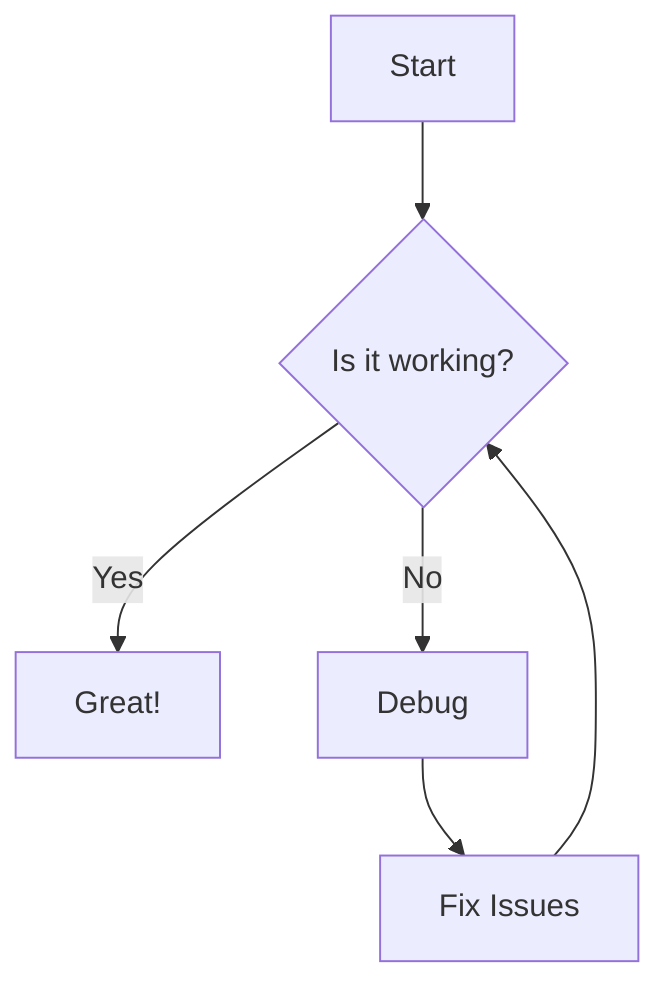
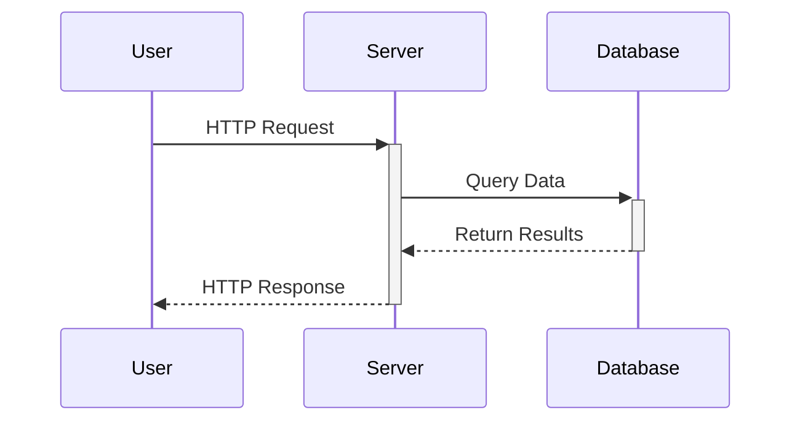
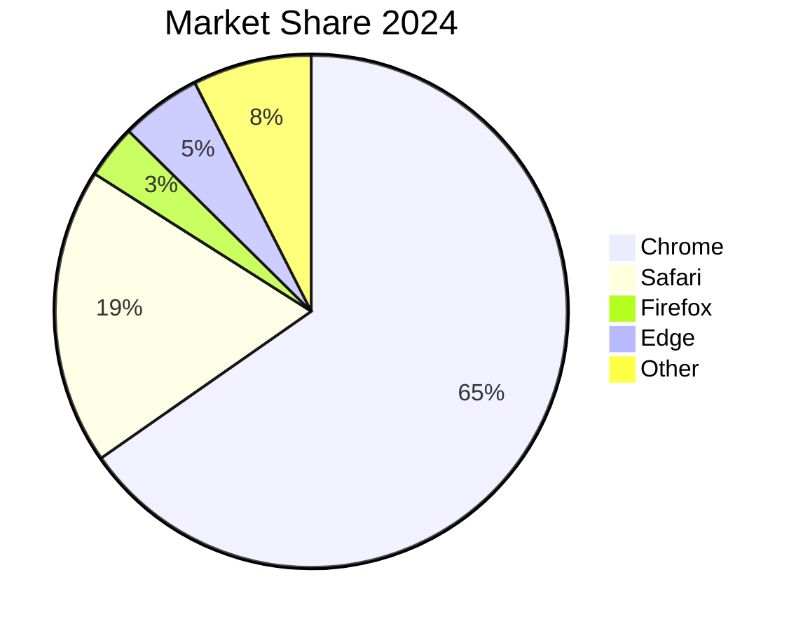
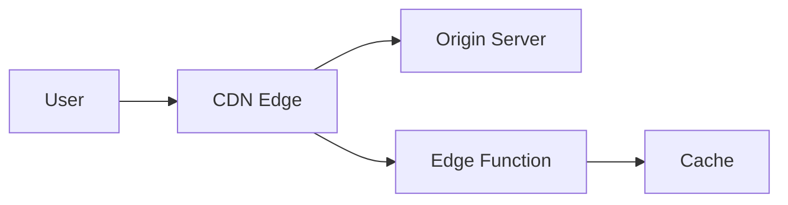

# MDX Blog Writing Guide

## Introduction

MDX (Markdown + JSX) allows you to write rich blog content using familiar Markdown syntax while supporting interactive components, references, and special formatting. This guide shows you how to write beautiful, professional blog posts.

---

## Basic Markdown Syntax

### Headings
```markdown
# H1 - Main Title (usually auto-generated)
## H2 - Section Headers
### H3 - Sub-sections
#### H4 - Smaller headers
```

**Best Practice:** Use `##` for main sections and `###` for subsections. The blog title is usually handled separately.

---

### Text Formatting
```markdown
**Bold text** for emphasis
*Italic text* for subtle emphasis
***Bold and italic*** for strong emphasis
~~Strikethrough~~ for deleted content
`inline code` for technical terms
```

---

### Lists

**Unordered List:**
```markdown
- First item
- Second item
  - Nested item
  - Another nested item
- Third item
```

**Ordered List:**
```markdown
1. First step
2. Second step
3. Third step
   1. Sub-step
   2. Another sub-step
```

---

### Links and Images

**External Link:**
```markdown
[Visit Flinke](https://flinke.com)
```

**Internal Link:**
```markdown
[Read our about page](/about)
```

**Image:**
```markdown

```

**Image with Caption Context:**
```markdown


*Figure 1: Our design team collaborating on the new product launch*
```

---

## References & Citations (Footnotes)

The blog system supports MDX-style references. These appear as superscript numbers that link to a references section at the bottom.

### How to Use References

```markdown
According to recent studies[^1], web performance directly impacts conversion rates. 
Research shows that faster loading times lead to higher engagement[^research-2024].

[^1]: Source: Google Web Vitals study, 2024 - https://web.dev/vitals/
[^research-2024]: Academic paper: "Impact of Page Speed on User Behavior" - Journal of Web Engineering, Vol 15.
```

**Output:**
- `[1]` and `[2]` appear as superscript links in the text
- Clicking them scrolls to the reference
- A "References" section is auto-generated at the bottom
- Each reference has a ↩ backlink to return to the text

### Best Practices for References
- Use simple IDs: `[^1]`, `[^2]`, `[^3]` for sequential references
- Use descriptive IDs: `[^web-vitals]`, `[^react-docs]` for clarity
- Always define the reference content at the bottom of your post
- Include URLs when referencing external sources

---

## Code Blocks

### Inline Code
```markdown
Use the `useEffect` hook for side effects.
```

### Code Blocks with Syntax Highlighting

**JavaScript:**
```markdown
```javascript
function greet(name) {
  return `Hello, ${name}!`;
}

console.log(greet('World'));
```
```

**CSS:**
```markdown
```css
.button {
  background: linear-gradient(135deg, #667eea 0%, #764ba2 100%);
  border-radius: 8px;
  padding: 12px 24px;
}
```
```

**TypeScript:**
```markdown
```typescript
interface User {
  id: string;
  name: string;
  email: string;
}

const getUser = async (id: string): Promise<User> => {
  return await fetch(`/api/users/${id}`).then(r => r.json());
};
```
```

---

## Blockquotes

Use blockquotes for:
- Customer testimonials
- Important callouts
- Quotes from experts
- Highlighted tips

```markdown
> "Design is not just what it looks like and feels like. Design is how it works."
> — Steve Jobs
```

**Tip Block:**
```markdown
> 💡 **Pro Tip:** Always optimize your images before uploading. Use WebP format for better compression without quality loss.
```

---

## Tables

```markdown
| Feature | Basic Plan | Pro Plan | Enterprise |
|---------|-----------|----------|------------|
| Price | $29/mo | $99/mo | Custom |
| Storage | 10 GB | 100 GB | Unlimited |
| Support | Email | Priority | 24/7 Phone |
| API Access | ❌ | ✅ | ✅ |
```

---

## Math Formulas (KaTeX)

Use `$` for inline math and `$$` for block math:

```markdown
The Pythagorean theorem: $a^2 + b^2 = c^2$

$$
E = mc^2
$$
```

**Complex Formula:**
```markdown
$$
\int_{-\infty}^{\infty} e^{-x^2} dx = \sqrt{\pi}
$$
```

---

## Mermaid Diagrams

Create flowcharts, sequence diagrams, and more:

**Flowchart:**
```markdown

```

**Sequence Diagram:**
```markdown

```

**Pie Chart:**
```markdown

```

---

## Charts (JSON-based)

```markdown
```chart
{
  "title": "Monthly Revenue Growth",
  "type": "line",
  "data": {
    "labels": ["Jan", "Feb", "Mar", "Apr", "May", "Jun"],
    "datasets": [{
      "label": "Revenue ($)",
      "data": [12000, 19000, 15000, 25000, 32000, 45000],
      "borderColor": "#667eea",
      "backgroundColor": "rgba(102, 126, 234, 0.1)"
    }]
  },
  "options": {
    "legend": true
  }
}
```
```

**Bar Chart Example:**
```markdown
```chart
{
  "title": "Traffic Sources",
  "type": "bar",
  "data": {
    "labels": ["Organic", "Direct", "Social", "Referral", "Email"],
    "datasets": [{
      "label": "Visitors",
      "data": [4500, 3200, 2800, 1500, 2100],
      "backgroundColor": ["#667eea", "#764ba2", "#f093fb", "#f5576c", "#4facfe"]
    }]
  }
}
```
```

---

## YouTube Video Embeds

Simply paste a YouTube URL on its own line:

```markdown
https://www.youtube.com/watch?v=dQw4w9WgXcQ
```

Or use the short URL:
```markdown
https://youtu.be/dQw4w9WgXcQ
```

The video will automatically embed in an optimized player.

---

## Horizontal Rules

Use horizontal rules to separate major sections:

```markdown
---
```

---

## Complete Blog Post Example

```markdown
# The Future of Web Development: 2024 Trends

Web development is evolving rapidly. Here are the key trends shaping the industry this year[^1].

## AI-Powered Development

Artificial intelligence is transforming how we build websites:

- **Code Generation** - AI can now write functional code from descriptions
- **Automated Testing** - Smart test generation and bug detection
- **Design-to-Code** - Convert Figma designs directly to React components

> 💡 **Tip:** Start experimenting with AI tools now to stay ahead of the curve.

## Performance Metrics

Core Web Vitals remain critical for SEO and user experience[^google-vitals]:

| Metric | Good | Needs Improvement | Poor |
|--------|------|-------------------|------|
| LCP | ≤2.5s | ≤4.0s | >4.0s |
| FID | ≤100ms | ≤300ms | >300ms |
| CLS | ≤0.1 | ≤0.25 | >0.25 |

## Modern Architecture

The shift toward edge computing is accelerating:



## Conclusion

Stay adaptable and keep learning. The web development landscape will continue to change rapidly.

---

[^1]: Source: State of JS Survey 2024 - https://stateofjs.com
[^google-vitals]: Google Core Web Vitals documentation - https://web.dev/vitals/
```

---

## Quick Reference Card

| Element | Syntax | Example |
|---------|--------|---------|
| Bold | `**text**` | **bold** |
| Italic | `*text*` | *italic* |
| Link | `[text](url)` | [link](url) |
| Image | `` |  |
| Code | `` `code` `` | `code` |
| Code block | ` ```lang ` | See above |
| List | `- item` | • item |
| Numbered | `1. item` | 1. item |
| Quote | `> text` | > quote |
| Table | `\|a\|b\|` | See above |
| Reference | `[^1]` | [1] |
| Definition | `[^1]: text` | At bottom |
| Math | `$x$` | $x$ |
| Rule | `---` | — |

---

Happy Writing! 🚀
