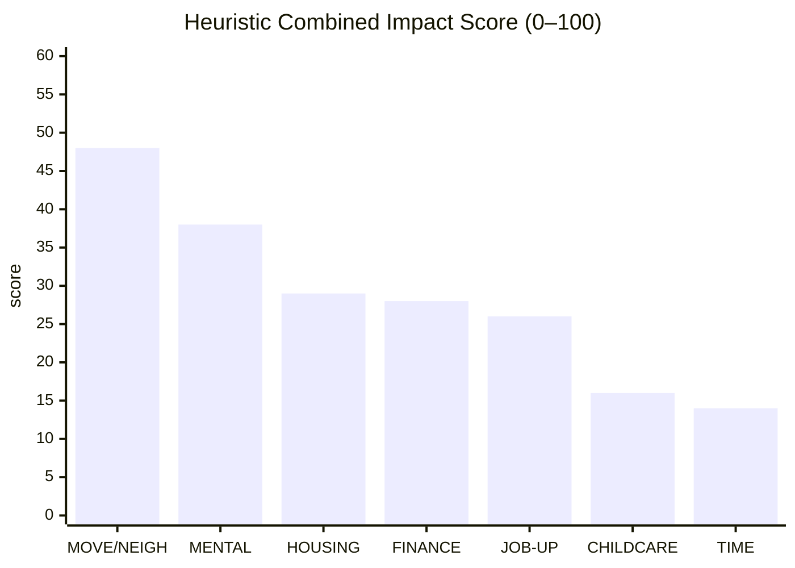
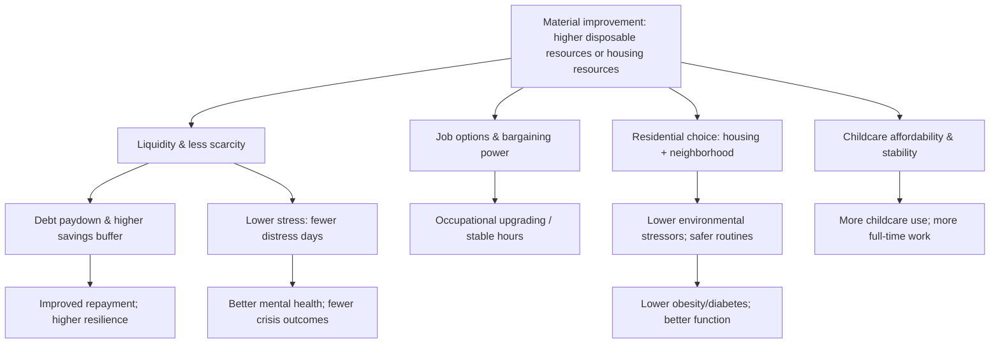

# High-Impact Life Changes After Material Improvement in Working Adults

## Executive summary

This report synthesizes recent (roughly 2011–2026) causal and longitudinal evidence on **what working adults change when their material conditions improve**, using “material improvement” to mean **a sustained rise in disposable resources** (earnings or transfers) and/or **a durable improvement in housing resources and neighborhood conditions**. The evidence base is strongest for policy-driven income changes (especially refundable tax credits) and randomized housing mobility; it is weaker for discretionary “lifestyle” choices like commuting or leisure in the long run. citeturn8view0turn31view2turn16view0turn10view0turn34view2

Across the most credible causal designs (RCTs, quasi-experimental expansions, and randomized wealth shocks), five life changes dominate by **combined impact = magnitude × prevalence × persistence**:

1. **Upgrading residential environment (move + housing quality/neighborhood) yields large, persistent health gains** when the move is large enough and sustained (e.g., voucher-enabled moves to lower-poverty neighborhoods). In the Moving to Opportunity (MTO) randomized mobility experiment, adults offered the “experimental” voucher experienced **lower psychological distress (−0.10 SD)** and **large reductions in severe obesity (BMI ≥ 35: −4.6 pp from a 35.1% control mean)** and **diabetes (−5.2 pp from a 20.4% control mean)** more than a decade later; physical limitations also fell (−4.8 pp from a 51.2% control mean). These are persistent, clinically meaningful changes. citeturn16view0turn16view1turn16view2

2. **Reducing mental health strain and stress responds quickly to income gains**—especially when the gain is predictable and recurring. In a quasi-experimental study of higher Earned Income Tax Credit (EITC) payments, a **$500 increase** was estimated to reduce **“bad mental health days” by ~19%** among mothers (from a baseline of 4.52 days/month), consistent with a strong channel from liquidity/scarcity relief to psychological well-being. citeturn8view0turn8view1

3. **Housing affordability and “de-doubling” improve with income supports, but extreme housing crises are harder to prevent.** A $1,000 increase in average EITC generosity reduced **moderate rent burden (≥30% of earnings) by 3.9 pp** and **severe burden (≥50%) by 5.2 pp**, and it reduced “doubling up” (shared living) by **~1.3–2.1 pp** in large national samples; however, effects on eviction/homelessness were statistically small in the same analyses. citeturn31view0turn31view1turn31view2

4. **Balance-sheet repair and liquidity management are common immediate responses to windfalls, with strong heterogeneity by financial constraint.** For U.S. stimulus payments (EIPs), estimated spending on nondurable goods in the first three months ranged from **~3% to ~16%** of the payment on average, but reached **~20–30%** among households in the bottom third of liquid wealth (identified as < ~$3,000 in liquid assets), indicating that the most constrained households partially convert cash to near-term consumption. citeturn20view0turn20view1 Evidence from a New York Fed survey similarly suggests that households split stimulus between **saving and debt payment** (with sizable shares allocated to each), consistent with a “repair first” pattern when liquidity constraints bind. citeturn1search35

5. **Occupational upgrading can generate large, persistent earnings gains, but prevalence depends on program reach and fit.** In the WorkAdvance sectoral-training RCT, one program site showed **very large 10-year earnings gains** (St. Nicks Alliance: +$8,580, ~32%, and +7 pp earning ≥$45,000 in Year 10), while pooled impacts were more modest (+$2,089 in Year 10; +3 pp earning ≥$45,000). The key point for “life changes” is that **sustained material improvements big enough to alter housing/health trajectories often require durable earnings growth**, not only one-off transfers. citeturn14view0turn14view2turn14view3

Two additional patterns are important for interpreting “what changes vs. what doesn’t”:

- **Money alone does not reliably change health behaviors.** In randomized lottery wealth studies in entity["country","Sweden","lottery studies oecd country"], prize size was associated with **near-zero changes** in smoking, drinking, physical activity, and diet (effects close to 0 SD), even for large wealth shocks. citeturn17view1  
- **Work time and “nonmarket time” reallocate mechanically with in-work credits.** An EITC increase of $1,000 raised weekly work activities by **~0.63 hours/week** in headline estimates and reduced leisure/home production time, indicating that some “material improvement” pathways increase time pressure (at least in the short-to-medium run). citeturn10view0turn10view1

## Evidence base and identification strategy

### Scope and populations

The report emphasizes working-age adults (roughly 25–64) with a practical focus on **low- and moderate-income workers**, because that is where (a) marginal income changes are mechanically larger relative to baseline, and (b) the best causal evidence exists (e.g., EITC expansions and targeted training). Several high-quality studies focus specifically on **single mothers**; while not “all working adults,” their results are informative about how constrained working households re-optimize housing, time use, and wellbeing when resources rise. citeturn31view2turn34view0turn8view0turn35view1

### Core longitudinal datasets and official statistical sources

The following sources are central for “real data” on income, health, housing, and time use—especially when linked to causal designs or panel methods:

- **Panel / cohort data**
  - entity["organization","Panel Study of Income Dynamics","us longitudinal survey 1968"] tracks families and descendants longitudinally and is frequently used for intergenerational and life-course outcomes. citeturn2search0  
  - entity["organization","Health and Retirement Study","us longitudinal survey age 50+ 1992"] follows older adults biennially and supports analyses of wealth/income shocks and late-career transitions. citeturn2search2  
  - entity["organization","Understanding Society","uk household panel 2009"] follows UK households and supports cross-national comparisons of income dynamics and wellbeing. citeturn2search9  

- **Time use**
  - entity["organization","U.S. Bureau of Labor Statistics","federal statistical agency us"] runs the entity["organization","American Time Use Survey","us time diary survey 2003"], which captures daily activity allocation and can be merged with policy variation for quasi-experimental designs. citeturn2search7turn2search11  
  - entity["organization","Organisation for Economic Co-operation and Development","international policy org paris"] compiles harmonized time-use indicators for cross-country context. citeturn3search2  

- **Housing**
  - entity["organization","U.S. Census Bureau","federal statistical agency us"] publishes housing and mobility measures; the entity["organization","American Housing Survey","us housing stock survey"] provides detailed housing quality and affordability measures over time. citeturn3search8turn3search4  

- **Health**
  - entity["organization","Centers for Disease Control and Prevention","public health agency us"] provides large surveillance systems including entity["organization","Behavioral Risk Factor Surveillance System","us state health survey"]. citeturn4search1  
  - CDC’s entity["organization","National Health Interview Survey","us household health survey"] provides nationally representative health insurance, utilization, and self-reported health measures. citeturn4search6  

- **Household balance sheets**
  - The entity["organization","Board of Governors of the Federal Reserve System","central bank us"] fields the entity["organization","Survey of Consumer Finances","us triennial household finance survey"], the main official source on assets, debts, and financial fragility distribution. citeturn4search7  

- **Microdata infrastructure**
  - entity["organization","IPUMS","microdata harmonization project"] provides harmonized microdata access for major surveys (ACS/CPS and others), which is critical for replication and subgroup analyses. citeturn4search4  

- **Cross-country macro context**
  - OECD’s Income Distribution Database provides disposable-income distribution context for OECD comparisons. citeturn3search0  

### Causal designs prioritized

This report weights results using a “credibility ladder,” prioritizing:

- **Randomized experiments**: MTO housing mobility. citeturn16view0turn16view1  
- **Natural experiments / quasi-experiments**: EITC expansions (parameterized difference-in-differences using simulated instruments, event studies), state EITCs and suicides, and time-use responses using policy variation. citeturn31view0turn8view0turn10view0turn35view0  
- **Randomized wealth shocks**: Swedish lottery prize designs. citeturn17view1turn18view0  
- **Large-scale RCT evaluations of labor-market interventions**: sectoral training (WorkAdvance). citeturn14view0turn14view2

## Ranked life changes

### Combined impact metric

To compare very different “life changes,” I use a **heuristic Combined Impact Score (0–100)**:

- **Magnitude**: standardized effect size (percentage-point change, SD change, or proportional change) at a meaningful income/housing increment.
- **Prevalence**: baseline prevalence of the constrained state in the affected group (e.g., share rent-burdened, doubled up, depressed).
- **Persistence**: typical duration (months vs. years vs. decade-scale) supported by follow-up windows.

Because prevalence is often only reported within study populations (e.g., single mothers, voucher applicants), scores should be read as **comparative within constrained working households**, not universal population ranks. citeturn31view2turn16view0turn20view0turn34view2

### Summary ranking table

| Life change (what people actually do / experience) | Typical causal effect size (magnitude) | Prevalence / baseline constraint (who it matters for) | Time horizon (persistence) | Key heterogeneity | Confidence & limitations | Core sources |
|---|---|---|---|---|---|---|
| **Move to (and remain in) a safer, lower-poverty neighborhood and higher-quality housing** | Psychological distress: −0.10 SD (experimental voucher offer). Severe obesity (BMI≥35): −4.6 pp; diabetes: −5.2 pp; physical limitation: −4.8 pp (treatment-on-treated / offer-based estimates reported). | High baseline burden in applicants: depression ~20%, BMI≥35 ~35%, diabetes ~20%, physical limitation ~51% in controls. | Long-run (10–15+ years). | Effects can differ by treatment arm (experimental vs traditional voucher) and baseline risk; strongest when moves are large and sustained. | **High** for health outcomes (RCT). External validity depends on housing-market conditions and feasibility of large neighborhood moves. | MTO long-term evaluation. citeturn16view0turn16view1turn16view2 |
| **Reduce “scarcity stress”: fewer bad mental health days and lower severe distress** | A $500 EITC increase → ~19% fewer “bad mental health days” (from 4.52 days/month). | High prevalence of stress/mental distress in low-income working households; baseline bad-mental-health days reported in study. | Medium-to-long (recurs annually with benefit; plausibly persistent while income support persists). | Likely strongest among primary caregivers and households near liquidity constraints. | **Medium–High** (strong quasi-experimental design; population skewed toward mothers). | EITC–maternal health quasi-experiment. citeturn8view0turn8view1 |
| **Lower housing cost burden and exit shared living (doubling up / multigenerational coresidence)** | $1,000 ↑ EITC → −3.9 pp cost burden ≥30% earnings; −5.2 pp severe burden ≥50%. Doubling up: −1.3 pp (ACS) to −2.1 pp (CPS). Multigenerational household: −0.4 pp (ACS) and −2.1 pp (CPS). Crowding: −2.1 pp (ACS). | In samples: cost burden ≥30% ~70%; ≥50% ~50%. Doubling up ~12–15% (CPS/ACS); multigenerational ~4–6%. | Medium-to-long (policy persists; housing adjustments may take 1–3 years). | Stronger in more disadvantaged cohorts (e.g., Fragile Families sample shows larger doubling-up changes). | **High** for cost burden & shared living; **lower** for eviction/homelessness (no clear effect). | EITC housing & living arrangements. citeturn31view0turn31view1turn31view2 |
| **Shift from “high-cost coping” to financial resilience: save more and repair balance sheets** | EITC: $1,000 policy-induced ↑ → +6 pp likelihood of any savings; +4 pp holding credit card debt (suggesting greater access/liquidity alongside savings). | Very high among low-income households with low liquid buffers and constrained credit access. | Short-to-medium (months to 1–2 years for balance-sheet changes), but can be persistent if institutionalized (auto-savings, lower delinquency). | Concentrated among those on the phase-in portion of EITC schedule (per abstract). | **Medium** (primary result from accessible abstract; full paper paywalls limit deeper effect mapping; direction consistent with multiple literatures). | EITC household finances abstract. citeturn25view0 |
| **Large earnings gains via targeted occupational upgrading (sectoral training)** | Year 10 gains: pooled +$2,089; +3 pp earning ≥$45k. One site: +$8,580 (~32%); +7 pp earning ≥$45k. | Low prevalence in population (requires enrollment/eligibility), but high relevance for low-wage workers. | Long-run (measured at ~10 years). | High site/program heterogeneity: some models deliver large gains; others modest. | **High** internal validity (RCT); generalization depends on program design and local labor demand. | WorkAdvance 10-year report. citeturn14view0turn14view2turn14view3 |
| **Increase childcare use and spending to enable work, especially for parents of infants/toddlers** | $1,000 ↑ EITC → parents of children <3: +23 pp using any childcare; +9.5 hours/week in care; +25 pp making childcare payments; ~+120% monthly childcare costs (~+$94/mo; ~+$1,100/year). Employment: +9 pp for mothers with children <3; +3.4 hours/week; +6.6 pp full-time. | Concentrated among those with youngest child 0–2; baseline childcare use ~65–71% varies by child age; parenting status limits prevalence among all workers. | Medium (childcare decisions persist while children are young; 1–3+ years). | Strong gradient by age of youngest child; effects much smaller for older children. | **Medium–High** (strong quasi-experimental design; results specific to unmarried mothers / low-income contexts; important offsetting-cost mechanism). | EITC × child age paper. citeturn34view0turn34view1turn34view2 |
| **Time reallocation: more work time, less leisure/home production (and sometimes less slack)** | $1,000 ↑ max EITC → +0.63 hours/week in work activities; reductions in leisure and home production reported. | Relevant where in-work credits raise participation (not universal). | Medium (as long as labor-supply incentives bind). | Differences by marital status and child age likely; interacts with childcare constraints. | **Medium** (credible design; time use is noisy; welfare interpretation depends on preferences and constraints). | EITC and time use. citeturn10view0turn10view1 |

### Visual comparison

The chart below converts the table into the heuristic Combined Impact Score (0–100) for constrained working households. Scores are approximate and intended to be directionally informative rather than exact.

Legend:  
- **MOVE/NEIGH** = sustained move to safer/lower-poverty neighborhood (MTO-like).  
- **MENTAL** = mental distress reduction from income supports.  
- **HOUSING** = reduced rent burden + reduced doubling up.  
- **FINANCE** = savings/debt/credit resilience changes.  
- **JOB-UP** = durable earnings gains via training/occupation shift.  
- **CHILDCARE** = childcare use/spending shifts enabling work.  
- **TIME** = time allocation changes.

## Mechanisms and domain-by-domain synthesis

### A mechanism map

The strongest evidence supports a mechanism chain in which “more resources” matter most when they relieve **binding constraints** (liquidity, housing market barriers, childcare access) rather than simply raising permanent income for already-unconstrained households. citeturn20view0turn31view2turn17view1turn34view2

### Income/earnings and employment hours

**Income supports raise measured resources and can change labor supply.** A quasi-experimental estimate indicates that a $1,000 policy-induced increase in the EITC reduces the share of families below poverty by **9.4 percentage points**, with effects concentrated around 75–150% of poverty (i.e., where the credit is largest). citeturn35view1  

For working adults, two “life changes” follow repeatedly:

- **More work attachment** in groups where extensive-margin incentives are strong (notably unmarried mothers). The child-age heterogeneity is large: after a $1,000 increase in average EITC generosity, mothers with youngest child under 3 see markedly larger changes than those with teens, including more hours and higher full-time work. citeturn34view0  
- **More time pressure** via reallocation from leisure/home production toward work activities in time-use accounts. citeturn10view0turn10view1  

Counterpoint: when income gains arrive as **unconditional universal payments**, labor supply responses may be small. In Alaska’s Permanent Fund Dividend, evidence suggests **little impact on employment**, with a modest increase in part-time work (+1.8 percentage points). citeturn6view2turn6view3

### Occupational shifts and training

The most consequential “material improvement” for many working adults is not a one-time gain, but a **new earnings path** (more stable, higher-paying work). Sectoral training provides unusually clear evidence here:

- In WorkAdvance’s 10-year follow-up, pooled impacts show **persistent earnings gains** and a higher likelihood of reaching a middle-earnings threshold, but results vary substantially by provider. citeturn14view0turn14view2  
- The large site-specific effects imply that a critical mechanism is **alignment with local labor demand and occupational ladders**, not training per se. citeturn14view3  

### Housing: move, upgrade, own, or share

Three housing margins repeatedly move when resources rise:

1. **Affordability repair (rent burden falls).** A $1,000 increase in EITC generosity reduces moderate and severe housing cost burdens by about **3.9 pp and 5.2 pp**, respectively. citeturn31view0turn31view2  

2. **Household composition normalization (“less doubling up”).** The same EITC variation reduced doubling up and multigenerational coresidence in large surveys; in a disadvantaged cohort, the doubling-up change was much larger. citeturn31view1turn31view2  

3. **Neighborhood environment change is where the biggest health effects appear.** MTO provides the cleanest evidence that large neighborhood upgrades can cause large health gains. citeturn16view0turn16view2  

What does **not** reliably change with moderate income supports: **rare extreme events** (homelessness, eviction) show small or non-robust effects in the EITC housing study—likely because the shocks that precipitate eviction/homelessness are often larger than the transfer increment. citeturn31view0turn31view2  

Homeownership is harder to generalize from this evidence; the EITC housing study reports no significant relationship with homeownership in their main analyses, suggesting that marginal income changes of the studied size are often insufficient to cross underwriting/down-payment thresholds. citeturn31view2

### Health behaviors, physical health, and mental health

A consistent pattern across causal studies is:

- **Mental health responds more reliably and quickly** than “deep” health behaviors (smoking, exercise, diet), especially when the income gain relieves scarcity and financial stress. citeturn8view0turn8view1turn35view0  
- **Physical health improvements are most robust when the environment changes**, not just income. In MTO, large long-run reductions in obesity and diabetes suggest mechanisms like built environment, food access, chronic stress exposure, and safety shaping daily routines. citeturn16view0turn16view2  
- **Large wealth shocks alone show limited lifestyle change**. The Swedish lottery evidence finds near-zero effects on smoking/drinking/activity/diet, even with large prizes. citeturn17view1  

At the severe end of mental-health outcomes, a difference-in-differences study of state EITC generosity found that introducing a high state EITC rate was associated with a **3.91% reduction in suicide rates (adults 25+)**. citeturn35view0

### Family formation, fertility, and household structure

Causal evidence linking “more money” to marriage/fertility among working adults is **mixed and thinner** than for housing and mental health. The EITC housing paper’s results on multigenerational coresidence and doubling up are a concrete “family structure” effect: income supports reduce shared living and crowding, moving families toward smaller household arrangements. citeturn31view1turn31view2  

On marriage/divorce and fertility specifically, the credible literature often highlights **offsetting incentives** (e.g., marriage penalties in means-tested credits) and heterogeneous responses; robust, recent OECD-wide causal synthesis remains a gap (see the Data gaps section). citeturn21search21turn31view2

### Childcare as a hinge mechanism between income and work

For parents (a large fraction of working adults), childcare is a pivotal mechanism that transforms “more income” into “more work capacity” and vice versa.

A quasi-experimental design shows that a $1,000 increase in average EITC generosity led mothers of children under 3 to:

- work more (hours and full-time),
- use substantially more childcare (+23 pp) and more hours (+9.5 hours/week),
- and pay significantly more for childcare (+25 pp paying; ~+120% monthly costs; ~$1,100/year), with much of the increased care occurring through informal arrangements. citeturn34view0turn34view1turn34view2  

This implies a key “life change”: **material improvement for constrained parents often buys labor supply**, but a nontrivial share of the earnings gain is **re-spent on childcare**. citeturn34view2

### Savings/debt and consumption patterns

Two robust empirical regularities show up across studies of cash-on-hand:

1. **Windfalls and transfers are partly used to stabilize the household balance sheet**, not only to consume. Evidence from stimulus payments shows strong heterogeneity by liquid wealth, with higher marginal spending among the most liquidity constrained. citeturn20view0turn20view1  
2. **Access to cheaper credit and reduced reliance on high-cost borrowing can amplify income gains.** A Federal Reserve study finds that higher minimum wages increase access to unsecured credit, reduce high-cost borrowing (payday loans), and improve delinquency/credit scores, arguing that reduced borrowing costs can substantially augment disposable income relative to direct wage gains. citeturn32view0  

The EITC household-finance abstract suggests that EITC expansions increased both the likelihood of holding some savings and credit card debt (consistent with improved credit access/liquidity plus savings). citeturn25view0

## What tends to work vs. fail

### Interventions or pathways that repeatedly “work” (with evidence)

**Housing mobility with real neighborhood change** works for long-run health and wellbeing when moves are large and durable (MTO’s most robust long-run results are in health). citeturn16view0turn16view2  

**Recurring income supports that relieve scarcity** produce measurable mental-health gains and housing affordability improvements (EITC-based evidence). citeturn8view0turn31view2turn35view1  

**Sectoral training aligned to labor demand** can generate durable earnings gains, but success is highly program-dependent—suggesting that design and employer linkage are decisive. citeturn14view0turn14view3  

**Complementary childcare support** is critical when income gains operate through increased employment; without childcare affordability/stability, households may be unable to convert higher wages into stable work. The EITC child-age evidence shows that childcare costs can absorb a large share of earnings gains for parents of very young children. citeturn34view2  

### Patterns that often “fail” or yield small effects

**Small-to-moderate cash increases are often insufficient to prevent rare catastrophic events** like eviction or homelessness in administrative/self-reported measures, even when they reduce average cost burden (an “intensive margin” success without an “extensive margin” crisis reduction). citeturn31view0turn31view2  

**Wealth shocks do not automatically change health behaviors**, implying that information, habit formation, addiction, and environment may dominate money in determining smoking/drinking/exercise. citeturn17view1  

**Time pressure can rise with in-work supports.** When material improvement comes via increased work attachment, leisure/home production can fall; evaluating welfare requires considering stress, childcare load, and schedule control, not only income. citeturn10view0turn34view0

## Recommendations and data gaps

### Policy recommendations grounded in the evidence

**Treat housing and neighborhood as health policy.** The largest persistent physical health effects in this review come from sustained neighborhood upgrades. Scaling impact likely requires: (a) increasing voucher availability and mobility support, and (b) addressing housing supply constraints that limit access to low-poverty neighborhoods. citeturn16view0turn16view2  

**Expand and stabilize in-work supports, with attention to “family constraints.”** EITC-like expansions reduce poverty substantially and improve housing affordability/mental health, but benefits for parents can be partially offset by childcare cost increases—suggesting that EITC expansions are more effective when paired with childcare affordability and availability policies. citeturn35view1turn31view2turn34view2  

**Invest in sectoral training with accountability for long-run earnings.** WorkAdvance highlights that some providers deliver large long-run gains while others do not, implying policy should fund models with demonstrated earnings impacts and employer linkage rather than generic training volume. citeturn14view2turn14view3  

**Reduce high-cost borrowing traps as an amplifier of earnings gains.** Evidence that higher minimum wages shift households away from payday loans and toward cheaper credit suggests that complementary credit-market policies (transparent pricing, safer small-dollar credit, defaults that reduce delinquency) can magnify the real purchasing power of wage gains. citeturn32view0  

### Individual-level recommendations aligned to what the data suggest people actually do

For working adults whose income rises, the evidence implies the highest-return personal “move set” is:

- **Prioritize housing stability and affordability first** (rent burden, crowding, and shared living are responsive and strongly linked to downstream stress). citeturn31view2  
- **Convert part of income gains into a liquidity buffer and debt-cost reduction**—because constrained households show strong marginal responses to cash-on-hand, and reduced borrowing costs can compound disposable income over time. citeturn20view0turn32view0  
- **For parents, plan for the childcare offset**: income gains that increase employment may trigger large childcare cost increases; proactively searching for stable arrangements (including informal and mixed care) is a practical necessity, not a side detail. citeturn34view2  
- **If a large neighborhood upgrade is feasible, treat it as a long-term health investment**, not only a housing decision—because that is where the biggest long-run physical health differences appear causally. citeturn16view0turn16view2  

### Data gaps and uncertainties

1. **Commuting time and social/leisure time**: credible causal estimates of how income gains change commuting and social time are limited; time-use evidence exists, but often captures short-run reallocation tied to labor supply rather than long-run stabilization. citeturn10view0turn2search7  

2. **Family formation and fertility among working adults in OECD settings**: evidence is fragmented and often confounded by policy incentive structure; there is no single recent OECD-wide causal synthesis equivalent to the housing/health evidence base. citeturn21search21turn31view2  

3. **Generalization beyond single mothers**: many of the cleanest EITC causal estimates are for single mothers; extrapolation to broader working adult populations should be done cautiously, using panels like PSID/HRS/Understanding Society to validate subgroup patterns. citeturn31view2turn2search0turn2search2turn2search9  

4. **Separating “income effects” from “environment effects”**: lottery evidence suggests money alone doesn’t change health behaviors, while MTO suggests environment does; future work should better integrate these channels (e.g., income supports that enable residential change). citeturn17view1turn16view2turn31view2  

### Prioritized sources

Primary/official datasets and infrastructure:
- PSID documentation. citeturn2search0  
- HRS documentation. citeturn2search2  
- Understanding Society documentation. citeturn2search9  
- ATUS documentation (BLS). citeturn2search7turn2search11  
- OECD time-use and income distribution database entries. citeturn3search2turn3search0  
- IPUMS USA documentation. citeturn4search4  
- CDC BRFSS and NHIS overview documentation. citeturn4search1turn4search6  
- American Housing Survey overview. citeturn3search8  
- Survey of Consumer Finances overview. citeturn4search7  

High-credibility causal studies and large evaluations:
- Moving to Opportunity long-term adult outcomes (RCT). citeturn16view0turn16view2  
- EITC and maternal mental health (quasi-experiment). citeturn8view0turn8view1  
- EITC and housing/living arrangements (parameterized DiD; CPS/ACS + cohort). citeturn31view0turn31view1turn31view2  
- EITC, child age, childcare and employment responses (parameterized DiD; heterogeneity). citeturn34view0turn34view2  
- WorkAdvance 10-year report (RCT; earnings persistence and site heterogeneity). citeturn14view0turn14view2turn14view3  
- Alaska Permanent Fund Dividend labor supply evidence. citeturn6view2turn6view3  
- Swedish lottery wealth: labor supply and health habits (randomized wealth shocks). citeturn18view0turn17view1  
- Stimulus/EIP spending response with heterogeneity by liquid wealth. citeturn20view0turn20view1  
- Minimum wages and consumer credit outcomes (Federal Reserve FEDS). citeturn32view0  
- State EITC generosity and suicide rates (difference-in-differences / policy changes). citeturn35view0